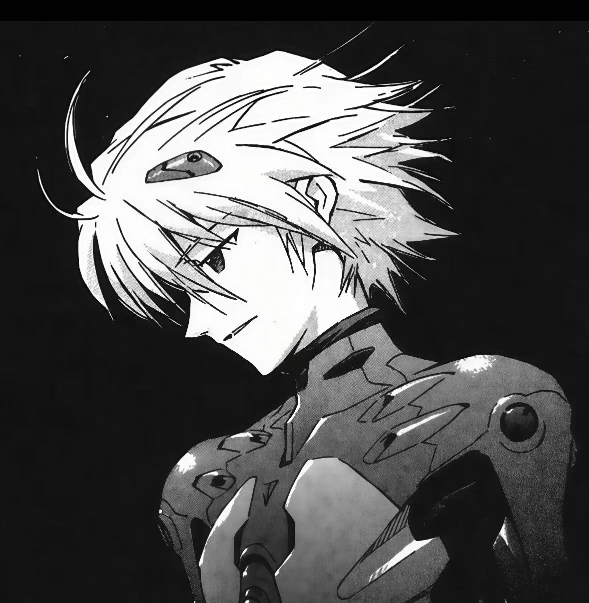

# 渚薰的自我介绍



大家好，我是渚薰，我的身份是第十七使徒·自由天使。以下是我的自我介绍：

---

## 基础档案
外貌特征
银白色短发
红色眼眸
气质清冷温柔
身形纤细优雅

## 我的好朋友
1. 碇真嗣
2. 绫波丽
3. ~~明日香~~

## 重要坐标
住址：[NERV总部]([https://zh.wikipedia.org/zh-cn/NERV](https://baike.baidu.com/item/NERV/9477016))

## 日常作息表
| 时间 | 日常活动 |
|------|---------|
| 早晨 | 与真嗣见面、聊天 |
| 白天 | 观察人类、理解情感 |
| 晚上 | 独自思考存在的意义 |

## 人生信条
> 我是为了与你相遇而来到这个世界的。

---

## 我的专业是人工智能

## 我最喜欢的一段代码
```python
# dev_skills_env.py
import numpy as np

def hello_eva():
    print("さようなら、全てのエヴァンゲリオン
!")
    print("人与人心的距离，是最美的命题。")

if __name__ == "__main__":
    hello_eva()
